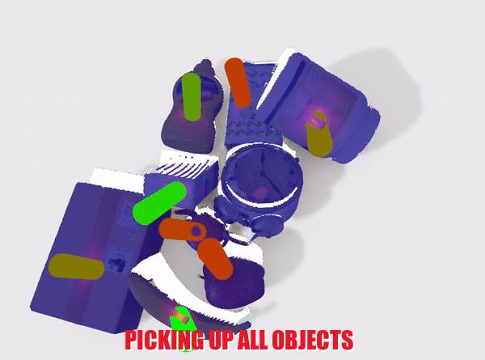
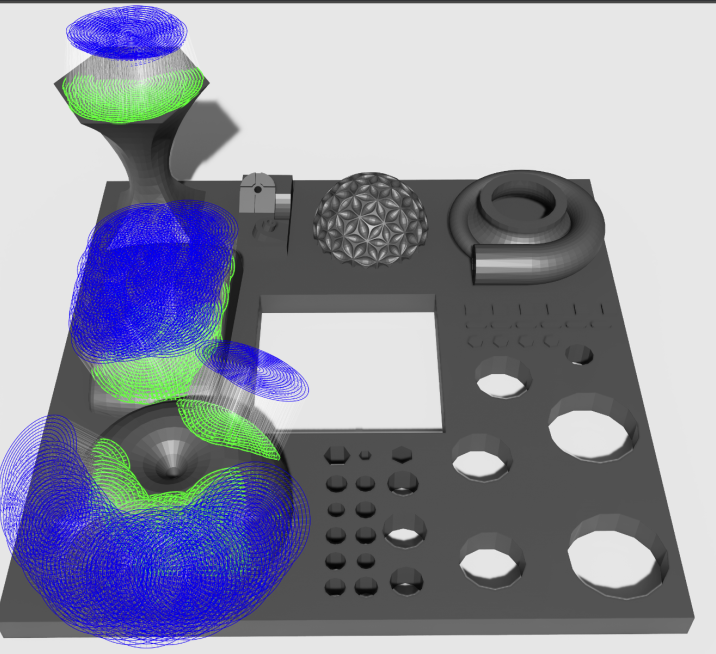
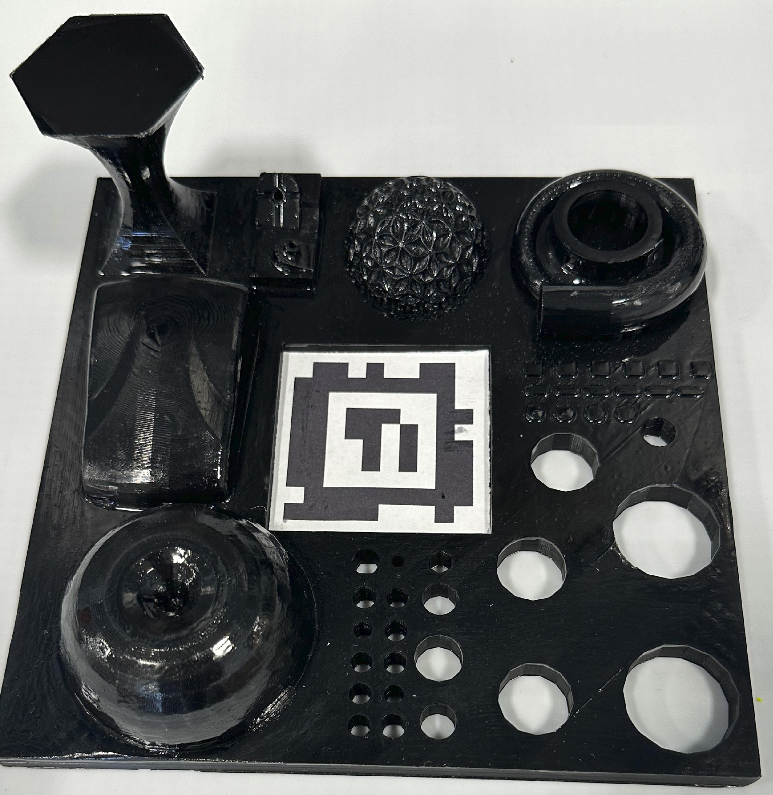
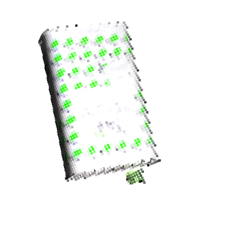
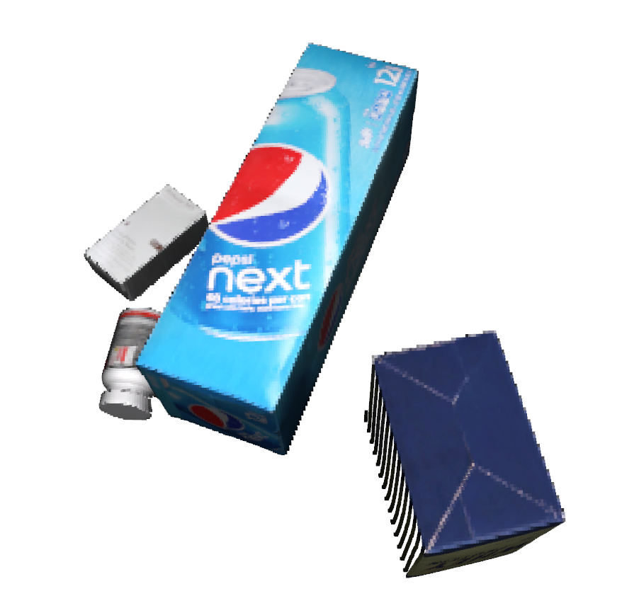

# 🚀 Sim-Suction-API

<div style="border: 4px solid #333; padding: 30px; border-radius: 30px;">

<p align="center">
  <br>
  <strong>Sim-Suction:</strong> Learning a Suction Grasp Policy for Cluttered Environments Using a Synthetic Benchmark.<br>
  Juncheng Li, David J. Cappelleri.<br>
  <br>IEEE Transactions on Robotics<br>
  <a href="https://arxiv.org/abs/2305.16378">Paper</a> | 
  <a href="https://junchengli1.github.io/Sim-Suction/"><strong>Project Website</strong></a>
</p>

<p align="center">
  
  
</p>

</div>

## Table of Contents
- [Isaac Sim Installation](#isaac-sim-installation)
  - [Deploy an Omniverse Virtual Workstation on AWS (Ubuntu Linux 20.04)](#deploy-an-omniverse-virtual-workstation-on-aws-ubuntu-linux-2004)
  - [Workstation Installation](#workstation-installation)
  - [System Requirements](#system-requirements)
- [Installing Isaac Sim Environment Dependencies](#installing-isaac-sim-environment-dependencies)
- [Generating Random Cluttered Scenes](#generating-random-cluttered-scenes)
- [Create Instanceable Assets (Optional)](#create-instanceable-assets-optional)
- [Point Cloud Generation and Seal Evaluation](#point-cloud-generation-and-seal-evaluation)
- [Scaling Simulation](#scaling-simulation)
- [Annotation Results Visualization](#annotation-results-visualization)
- [Sim-Suction-Pointnet (Base-Model)](#sim-suction-pointnet-base-model)
  - [Label Processing](#label-processing)
  - [Model Training](#model-training)
  - [Testing Dataset Generation (Single Shot)](#testing-dataset-generation-single-shot)
  - [Inference](#inference)
  - [Online Evaluation (slow)](#online-evaluation-slow)
- [Sim-Suction-Policy](#sim-suction-policy)
  - [Prerequisites](#prerequisites)
  - [How to Run the Demo](#how-to-run-the-demo)
  - [Example Results: Picking Up Cups](#example-results-picking-up-cups)
- [Release Notes](#release-notes)
  - [[v1.0.0] - 2023-10-05](#v100---2023-10-05)
  - [[v1.0.1] - Upcoming Release](#v101---upcoming-release)
- [Citations](#citations)

## Isaac Sim Installation

### Deploy an Omniverse Virtual Workstation on AWS (Ubuntu Linux 20.04)

- [Official NVIDIA Documentation](https://docs.omniverse.nvidia.com/nucleus/latest/enterprise/cloud_aws_ubulinux_vdi.html)

#### Important Notes:
- **InstanceType**: Use `g5.2xlarge` instance type or larger for optimal performance and to prevent memory leak issues.
- **DiskSize**: Recommend at least `500GB`.
- **DiskType**: Prefer General Purpose SSD volumes (`gp2` or `gp3`). A throughput of `500 MiB/s` or higher is advisable.

### Workstation Installation

- [Official NVIDIA Documentation](https://docs.omniverse.nvidia.com/isaacsim/latest/install_workstation.html)

### System Requirements

- [Official NVIDIA Isaac Sim Documentation](https://docs.omniverse.nvidia.com/isaacsim/latest/requirements.html)

| Element  | Good                                      | Ideal                                             |
| -------- | ----------------------------------------- | ------------------------------------------------- |
| OS       | Ubuntu 20.04/22.04                        | Ubuntu 20.04/22.04                                |
| CPU      | Intel Core i7 (9th Generation)<br>AMD Ryzen 7 | Intel Core i9, X-series or higher<br>AMD Ryzen 9, Threadripper or higher |
| Cores    | 8                                         | 16                                                |
| RAM      | 64GB*                                     | 64GB*                                             |
| Storage  | 500GB SSD                                 | 1TB NVMe SSD                                      |
| GPU      | GeForce RTX 3080                          | RTX A6000                                         |
| VRAM     | 10GB*                                     | 48GB*                                             |

#### Important Notes:
- **Isaac Sim Version used in this repo**: Isaac Sim `2022.2.1` (Ubuntu `20.04` or later, GPU Driver `525.60.11`)

## Installing Isaac Sim Environment Dependencies

Before launching the project, ensure to install all the necessary dependencies:

1. **Navigate to your Isaac Sim installation directory**: 
   Replace the given path with your specific installation directory if different:

   ```bash
   cd path_to_your_isaac_sim_directory
   # For instance:
   cd ~/.local/share/ov/pkg/isaac_sim-2022.2.1
   ```

2. **Install the necessary dependencies**: 
   Navigate to the `Sim-Suction-API` directory (which is this repository's root folder) and locate the `isaac_sim_gen` folder. Within it, you'll find the `issac_sim_requirements.txt` file. Replace `[YOUR_PATH_TO_THIS_REPO]` with the path to the `Sim-Suction-API` directory on your machine.
   
   ```bash
   ./python.sh -m pip install -r [YOUR_PATH_TO_THIS_REPO]/Sim-Suction-API/isaac_sim_gen/issac_sim_requirements.txt
   ```

## Generating Random Cluttered Scenes

Use the [`generate_cluttered.py`](isaac_sim_gen/generate_cluttered.py) script to create synthetic cluttered environments. Below are the available options you can configure:

```bash
cd path_to_your_isaac_sim_directory

./python.sh [YOUR_PATH_TO_THIS_REPO]/Sim-Suction-API/isaac_sim_gen/generate_cluttered.py [OPTIONS]
```
### Options for `generate_cluttered.py`:

- `--headless`
   - **Description**: Run in headless mode.
   - **Type**: Boolean 
   - **Default**: `False`
  

- `--asset_path`
   - **Description**: Specify the path for the NVIDIA assets.
   - **Type**: String
   - **Default**: `../nvidia_assets/*.usd` (relative to the script's directory)
   

- `--asset_path1`
   - **Description**: Specify the path for the ShapeNet assets (subset).
   - **Type**: String
   - **Default**: `../ShapeNet/*.usd` (relative to the script's directory)
  

- `--save_data_path`
   - **Description**: Define the path to save the generated data.
   - **Type**: String
   - **Default**: `../synthetic_data` (relative to the script's directory)


- `--objects_per_stage`
   - **Description**: Determine the minimum and maximum number of objects per stage.
   - **Type**: Int (Two values expected)
   - **Default**: `1 20`
   

- `--max_stage`
   - **Description**: Define the number of cluttered environments.
   - **Type**: Int
   - **Default**: `500`
   
## Create Instanceable Assets (Optional)

To reduce memory consumption, it's beneficial to leverage the USD’s Scenegraph Instancing functionality. This allows you to mark common meshes shared by different copies of the same robots as instanceable. Note that the instanceable assets are textureless.

Use the [`convert_instance.py`](isaac_sim_gen/convert_instance.py) script to facilitate this process:

```
cd path_to_your_isaac_sim_directory

./python.sh [YOUR_PATH_TO_THIS_REPO]/Sim-Suction-API/isaac_sim_gen/convert_instance.py [OPTIONS]
```
### Options for `convert_instance.py`:

- `--headless`
   - **Description**: Run in headless mode (Make it True when generating the dataset).
   - **Type**: Boolean 
   - **Default**: `False`
   

- `--data_path`
   - **Description**: Define the path for the data.
   - **Type**: String
   - **Default**: `../synthetic_data` (relative to the script's directory)
  
- **Output**:

  - The script will save the processed data with a naming format as follows:
    ```
    [YOUR_PATH_TO_THIS_REPO]/Sim-Suction-API/synthetic_data/stage_{stage_ind}_instanceable.usd
    ```
  - Where `{stage_ind}` will be replaced by the stage index number. 
  
## Point Cloud Generation and Seal Evaluation

Utilize the [`pointcloud_seal_eval.py`](isaac_sim_gen/pointcloud_seal_eval.py) script to generate point clouds and evaluate seals. 

Execute the script with:

```bash
./python.sh [YOUR_PATH_TO_THIS_REPO]/Sim-Suction-API/isaac_sim_gen/pointcloud_seal_eval.py [OPTIONS]
```

### Options:

- `--headless`
  - **Description**: Run in headless mode (Set to True when generating the dataset).
  - **Type**: Boolean
  - **Default**: `False`
  

- `--debug_draw`
  - **Description**: Enable or disable debug draw (Set to False when generating the dataset).
  - **Type**: Boolean
  - **Default**: `True`


- `--pcl_path`
  - **Description**: Define the path for point cloud storage.
  - **Type**: String
  - **Default**: `../pointcloud_train` (relative to the script's directory)
  

- `--data_path`
  - **Description**: Specify the data path.
  - **Type**: String
  - **Default**: `../synthetic_data` (relative to the script's directory)


- `--instanceable_flag`
  - **Description**: Use textureless instanceable USD to boost simulation speed.
  - **Type**: Boolean
  - **Default**: `True`

- `--seg_dic_path`
  - **Description**: Path for the segmentation dictionary.
  - **Type**: String
  - **Default**: `../seg_dic.pkl` (relative to the script's directory)

- `--save_pcd_flag`
  - **Description**: Save each object as a pcd file.
  - **Type**: Boolean
  - **Default**: `False`

- `--save_pkl_flag`
  - **Description**: Save the seal evaluation as a pkl file.
  - **Type**: Boolean
  - **Default**: `False`

- `--save_pcl_flag`
  - **Description**: Save the merged point cloud as an npz file.
  - **Type**: Boolean
  - **Default**: `False`

- `--suction_radius`
  - **Description**: Define the suction radius (in centimeters).
  - **Type**: Float
  - **Default**: `1.5`
 

- `--deformation_threshold`
  - **Description**: Set the deformation threshold (expressed as a percentage).
  - **Type**: Float
  - **Default**: `0.15`
 
### Outputs:
- **.pcd File**: 
  - **Format**: `stage_folder+"/"+class_name+"_"+object_number+".pcd"`
  - Represents individual objects.

- **.pkl File**: 
  - **Format**: `data_root+"/stage_"+stage_ind+"/"+"stage_"+stage_ind+"_candidates_after_seal.pkl"`
  - Contains dictionary data structure for the seal evaluation with keys such as:
    - `segmentation_id`, `object_name`, `rotation_after_seal_pass`, and more.

- **.npz File**: 
  - **Format**: `pointcloud_root+"/"+stage_ind+".npz"`
  - Represents the merged point cloud data with combined data points.


### Digital twin testing board:

Use the 1:1 testing board to evaluate the seal model.

Use `./testing_board/test_board.usd` to generate candidates after seal evaluation, and use `./testing_board/test_board.fbx` to 3D print the 1:1 model to perform real experiments.


<table>
<tr>
<td style="text-align: center; vertical-align: top;">
    <div>
      
      <br>
      <span>Test Board Simulation</span>
    </div>
</td>
<td style="text-align: center; vertical-align: top;">
    <div>
      
      <br>
      <span>Test Board 3D printed</span>
    </div>
</td>
</tr>
</table>


</details>


## Scaling Simulation

The simulation module orchestrates the process of simulating the UR10 robot's interactions with cluttered environments. It uses Isaac Sim to visualize and evaluate the robot's suction operations.

### Simulation Setup

Before initiating the simulation, ensure the following:

- The robot and suction cup USD files are located in the [`../Props`](Props) directory.
- The [`simulation_utils.py`](isaac_sim_gen/simulation_utils.py) file has the correct settings for the [`SurfaceGripper`](https://github.com/junchengli1/Sim-Suction-API/blob/a9e829c36135db165a5aa3581354176450ffd0d4/isaac_sim_gen/simulation_utils.py#L917) function handle, which manages the suction parameters.


### Running the Simulation

Execute the simulation script [`suction_simulation.py`](isaac_sim_gen/suction_simulation.py) using the following:

```bash
./python.sh [YOUR_PATH_TO_THIS_REPO]/Sim-Suction-API/isaac_sim_gen/suction_simulation.py [OPTIONS]
```

### Script Options:

- `--headless`: Run the simulation in headless mode. Set to `True` when generating the dataset.
  - **Type**: Boolean
  - **Default**: `False`

- `--RobotArm_path`: Specifies the path to the robot's USD file.
  - **Type**: String
  - **Default**: `../Props/ur10_invisible_suction.usd`

- `--SuctionCup_path`: Specifies the path to the robot's suction cup USD file.
  - **Type**: String
  - **Default**: `../Props/short_gripper.usd`

- `--data_path`: Path to the synthetic data directory.
  - **Type**: String
  - **Default**: `../synthetic_data`

- `--start_stage`: Determines the initial stage index for the simulation.
  - **Type**: Int
  - **Default**: `0`

- `--end_stage`: Determines the concluding stage index for the simulation.
  - **Type**: Int
  - **Default**: `500`

- `--grid_space`: Defines the grid spacing utilized when cloning environments.
  - **Type**: Int
  - **Default**: `300`

### Outputs:
The script generates a `.pkl` file containing a dictionary data structure for the simulation evaluation results with keys such as `rotation_after_exp_success`, `translation_after_exp_success`, `object_mass`, and more. The file is saved in the following format:

`data_root+"/stage_"+stage_ind+"/"+"stage_"+stage_ind+"_candidates_after_simulation.pkl"`


## Annotation Results Visualization 
This script visualizes the suction evaluation results. It uses the [Open3D](http://www.open3d.org/) library to display 3D point clouds and mesh objects.

### Requirements

- Python 3.6 or later
- Open3D 0.9.0 or later
- NumPy 1.16.0 or later

### Usage

To run the script, use the following command:

`python3 [YOUR_PATH_TO_THIS_REPO]/Sim-Suction-API/isaac_sim_gen/`[`view_suction.py`](isaac_sim_gen/simulation_utils.py) `[--data_path DATASET_PATH] [--stage_ID STAGE_ID] [--mode MODE] [--ground GROUND_PLANE] [--suction_radius RADIUS]`

The command-line arguments are as follows:

- `--data_set_path`: The path to the dataset directory. Default is `synthetic_data`.
- `--stage_ID`: The stage ID number. Default is `0`.
- `--mode`: The type of check to visualize. Choices are `collision`, `seal`, or `simulation`. Default is `seal`.
- `--ground`: Whether to include the ground plane in the visualization. Choices are `True` or `False`. Default is `False`.
- `--suction_radius`: The suction radius to use. Default is `1.5`. 

### Output

The script generates a 3D visualization of the suction annotation results for the specified dataset and parameters. The visualization includes the point cloud data, suction candidates, and collision/seal/dynamic simulation results.

## Sim-Suction-Pointnet (Base-Model)

### Label Processing
Execute the script [`sim_suction_label_processing.py`](Sim-Suction-Pointnet/sim_suction_label_processing.py) using the following:

```bash
python3 [YOUR_PATH_TO_THIS_REPO]/Sim-Suction-API/Sim-Suction-Pointnet/sim_suction_label_processing.py [OPTIONS]
```

#### Options

- `--pcl_path`: Path to the point clouds.
- `--data_path`: Path to the data.
- `--label_path`: Path to save the labels.
- `--save_label_flag`: Flag to save the suction labels as an npz file (default: `False`).
- `--has_color`: Flag to indicate if the point cloud has a color channel (default: `False`).
- `--start_stage`: Starting stage number (default: `0`).
- `--end_stage`: Ending stage number (default: `500`).
- `--suction_radius`: Suction radius for the KDTree (default: `1.5`).
- `--debug_draw`: Flag to enable debug drawing mode (default: `False`).

#### Output

The script generates the training suction labeling (binary) and stored in [`../sim_suction_label`](sim_suction_label) folder.

### Model Training

The code has been tested with `CUDA 11.7` and `pytorch 1.13.1` on ubuntu `20.04`. The training was performed on 2 A100 (80G) for 200 epochs.

#### Usage
Download and set your dataset paths:

```bash
data_root="/path/to/your/pointcloud_train"
suction_label_root="/path/to/your/sim_suction_label"
```

Install the utils of pointnet++ backbone:

```bash
cd /path/to/your/sim_suction_model/utils/pn2_utils
python3 setup.py install --user
cd /path/to/your/sim_suction_model/utils/pn2_utils/fuctions
python3 setup.py install --user
```
Execute the script [sim_suction_train.py](Sim-Suction-Pointnet/sim_suction_train.py) using the following:

```
python3 sim_suction_train.py [OPTIONS]
```
Options used in this repo:
- `--batch-size`: Specify the batch size for training (default is 64).
- `--model-path`: To saved model path

### Testing Dataset Generation (Single Shot)

#### Downloading the Assets and Datasets
- Download the [`google_selected Assets(novel)`](https://purdue0-my.sharepoint.com/:f:/g/personal/li3670_purdue_edu/ErC-OcsPEMJIk14BGrCpQBkBpWkYp1BOpMr2jJDBWEqeew?e=ZagljU) and store it in `../google_selected` folder.

- Download the [`test_similar dataset`](https://purdue0-my.sharepoint.com/:f:/g/personal/li3670_purdue_edu/Ek90onySwUFMoOnhBSxiM4wB-xHs9KVSXDMjd42gi_jXbQ?e=gAhJhs) and store it in `../test_similar` folder or use [generate_cluttered](#generating-random-cluttered-scenes) script to generate your own test_similar dataset.

- Download the [`test_novel dataset`](https://purdue0-my.sharepoint.com/:f:/g/personal/li3670_purdue_edu/EoEUWV-1nK5DiShO3AIosmoBgfAV-7tH6f1O0PrCpODGUg?e=ngs7EL) and store it in `../test_novel` folder or use [generate_cluttered](#generating-random-cluttered-scenes) script to generate your own test_novel dataset. (Note: use [`novel_seg_dic.pkl`](novel_seg_dic.pkl) generated from google_selected Assets for novel dataset)


#### Generate Testing Dataset Single Shot Point Cloud
```bash
cd path_to_your_isaac_sim_directory

./python.sh [YOUR_PATH_TO_THIS_REPO]/Sim-Suction-API/isaac_sim_gen/test_single_shot_generator.py [OPTIONS]
```
#### Options:

- `--dataset_type`: Choose the dataset type (either `test_similar` or `test_novel`).
  - Type: String
  - Default: `test_novel`

- `--headless`: Run in headless mode (Make it True when generating the dataset).
  - Type: Boolean
  - Default: False

- `--data_path`: Define the path for the data.
  - Type: String
  - Default for `test_similar`: `../test_similar` (relative to the script's directory)
  - Default for `test_novel`: `../test_novel` (relative to the script's directory)

- `--seg_dic_path`: Define the path for the segmentation dictionary.
  - Type: String
  - Default for `test_similar`: `../seg_dic.pkl` (relative to the script's directory)
  - Default for `test_novel`: `../novel_seg_dic.pkl` (relative to the script's directory)

- `--save_pcl_path`: Define the path to save the single shot point cloud as an npz file.
  - Type: String
  - Default for `test_similar`: `../test_similar_pointcloud` (relative to the script's directory)
  - Default for `test_novel`: `../test_novel_pointcloud` (relative to the script's directory)

- `--save_pcl_flag`: Flag to save the single shot point cloud as an npz file.
  - Type: Boolean
  - Default: True

- `--frame_per_stage`: Define how many frames per stage.
  - Type: Int
  - Default: 100

- `--start_stage`: Define the starting stage number.
  - Type: Int
  - Default: 0

- `--end_stage`: Define the ending stage number.
  - Type: Int
  - Default: 100

- `--visualization_flag`: Flag to visualize the point cloud.
  - Type: Boolean
  - Default: False

#### Visualize point clouds

To visualize point clouds from either the `test_similar` or `test_novel` dataset, use the command below:

```bash
python3 [YOUR_PATH_TO_THIS_REPO]/Sim-Suction-API/isaac_sim_gen/view_pointcloud.py [OPTIONS]
```
- `--dataset_type`: Choose the dataset type (either `test_similar` or `test_novel`).
  - Type: String
  - Default: `test_novel`

- `--stage`: Define the stage number.
  - Type: Int
  - Default: 0

- `--frame`: Define the frame number.
  - Type: Int
  - Default: 0

<table>
<tr>
<td style="text-align: center; vertical-align: top;">
    <div>
      
      <br>
      <span>Point Cloud from Test_Similar</span>
    </div>
</td>
<td style="text-align: center; vertical-align: top;">
    <div>
      
      <br>
      <span>Point Cloud from Test_Novel</span>
    </div>
</td>
</tr>
</table>

### Inference

Execute the script [sim_suction_inference.py](Sim-Suction-Pointnet/sim_suction_inference.py) using the following:

```
python3 sim_suction_inference.py [OPTIONS]
```
#### Options:

- `--pointcloud_test_path`: Point cloud path.
  - Default: `../test_novel_pointcloud`
  - Choices: `../test_similar_pointcloud`, `../test_novel_pointcloud`
  
- `--save_result_path`: Save result path.
  - Default: `../test_novel_inference_result`
  - Choices: `../test_similar_inference_result`, `../test_novel_inference_result`

- `--total_frame`: Total frame number.
  - Default: `100`
  
- `--total_stage`: Total stage number.
  - Default: `100`

- `--model_name`: Model name.
  - Default: `/MV_PCL_1550_500.model`
  
- `--model_path`: Saved model path.
  - Default: (base_dir / 'models').as_posix()
  
- `--visualize`: Which subset to visualize.
  - Default: `top_1%`
  - Choices: `top_1`, `top_1%`, `top_5%`, `top_10%`
  
- `--visualization_flag`: Visualization flag.
  - Default: `False`
  
- `--save_result_flag`: Save inference result flag.
  - Default: `True`


### Online Evaluation (slow)

Execute the script [sim_suction_eval.py](Sim-Suction-Pointnet/sim_suction_eval.py) using the following:

(Notes: slow process takes more than 24 hours)

``` bash
cd path_to_your_isaac_sim_directory

./python.sh [YOUR_PATH_TO_THIS_REPO]/Sim-Suction-API/Sim_Suction_Pointnet/sim_suction_eval.py [OPTIONS]
```

To get result metrics from saved `../test_similar_eval_result`, execute the script [eval_post_processing.py](Sim-Suction-Pointnet/eval_post_processing.py) using the following:


```
python3 eval_post_processing.py [OPTIONS]
```


## Sim-Suction-Policy

<p align="center">
  
</p>


### Prerequisites

- Please follow the [tutorial](sim_suction_policy/README.md) to install GroundingDINO and Segment Anything.
- Download the [pretrained weights](https://purdue0-my.sharepoint.com/:f:/g/personal/li3670_purdue_edu/EjELsTRGI_hOoAYTfaDTi8kBE9tAgELIx_hvxh3aLbk4fg?e=WJBreb) for GroundingDINO (zero-shot) and Segment Anything (zero-shot).

### How to Run the Demo

Execute the [sim_suction_demo.py](sim_suction_policy/sim_suction_demo.py) script as follows:

```bash
python3 sim_suction_demo.py [OPTIONS]
```
Notes: use RGB and registered point cloud from [demo folder.](sim_suction_policy/demo/)

- `--text_prompt`: 
  - **Description**: This specifies the text prompt for object selection. If set to "all objects", the system will attempt to pick up all objects and then choose the best object to grasp. If set to "one object", it will aim to pick up a single specified object.
  - **Type**: String
  - **Default**: "all objects"
  - **Choices**: "all objects", "specific object name"

- `--box_threshold`:
  - **Description**: Threshold for bounding box detection.
  - **Type**: Float
  - **Default**: 0.27

- `--text_threshold`:
  - **Description**: Threshold for text detection.
  - **Type**: Float
  - **Default**: 0.3

- `--device`:
  - **Description**: Specifies the device to run the demo on.
  - **Type**: String
  - **Default**: "cuda"

- `--demo_path`:
  - **Description**: Specifies the path to the demo.
  - **Type**: String
  - **Default**: `current_directory+"/demo"`

- `--demo_number`:
  - **Description**: Specifies the demo number.
  - **Type**: String
  - **Default**: "demo"

- `--suction_confident_threshold`:
  - **Description**: Sets the confident threshold for suction poses. Suction poses with confidence scores lower than this threshold will not be considered suitable.
  - **Type**: Float
  - **Default**: 0.2


### Example Results: Picking Up Cups

The visualization below showcases the system's capability to identify and select cups for grasping.

- **Blue shades with heatmap**: Represents the segmented point cloud specifically for the cups.
- **Green Marker**: Indicates the predicted suction grasp poses that exceed the `suction_confident_threshold`. The greener the marker, the higher the confidence score.

<p align="center">
  
</p>


## Release Notes

Here you will find information about the updates and improvements in each release.

### [v1.0.0] - 2023-10-05
#### Added
- Initial release of Sim-Suction API.
- Simulation framework.
- Synthetic data generation and training models.
- Sim-Suction-Pointnet grasping policy with language guided object-aware suction grasping.

### [v1.0.1] - Upcoming Release
- Release ROS wrapper for Sim-Suction-Pointnet grasping policy.

## Citations

If you find this work useful for your research, please consider citing our paper:

```bibtex
@ARTICLE{10314015,
  author={Li, Juncheng and Cappelleri, David J.},
  journal={IEEE Transactions on Robotics}, 
  title={Sim-Suction: Learning a Suction Grasp Policy for Cluttered Environments Using a Synthetic Benchmark}, 
  year={2023},
  volume={},
  number={},
  pages={1-16},
  doi={10.1109/TRO.2023.3331679}}
